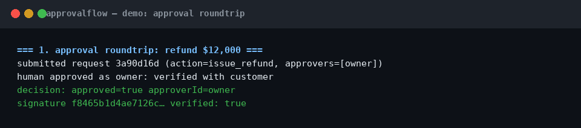
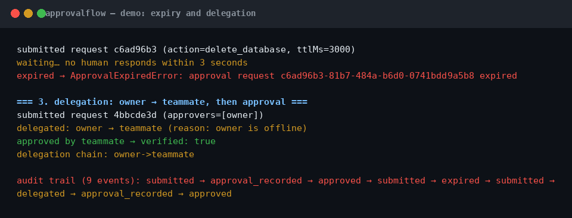

# approvalflow

A human approval queue for AI agents: the agent submits a request, a human approves or denies it, the agent resumes with a signed decision.

[](https://github.com/richardsondx/approvalflow/actions/workflows/ci.yml)
[](LICENSE)

## The problem

- Autonomous agents take irreversible actions: refunds, deletes, publishes, transfers.
- Every framework ships an interrupt or approval flag, but none records who approved, when the approval expires, who it was delegated to, or why.
- Anthropic's telemetry showed users auto-approved roughly 93% of Claude Code permission prompts, so a bare prompt is not a control.
- approvalflow is the missing piece: approvals stay rare because they are risk-keyed, and stay trustworthy because each decision is HMAC-signed and audit-logged.

## How it works (30 seconds)

```
Agent                          approvalflow                      Human
  |                                 |                              |
  |-- queue.submit({action, ...}) -->|                              |
  |                                 |-- webhook / onEvent --------->|
  |                                 |   "approve issue_refund?"     |
  |<-- req.wait() blocks ------------|                              |
  |                                 |<-- queue.approve(id) --------|
  |<-- { approved, signature } ------|                              |
  |                                                                |
  |   TTL passes with no decision:                                 |
  |                                 |-- auto-deny (or escalate) --->|
  |<-- ApprovalExpiredError --------|                              |
```

Requests persist as one JSON file each, so a restart never loses a pending approval. Every state change appends to `audit.jsonl`. Decisions are HMAC-SHA256 signed and verifiable offline.

## Install

```sh
npm i approvalflow
```

Zero runtime dependencies. Requires Node 20+.

## Quickstart

```ts
import { createQueue } from "approvalflow";

const queue = createQueue({ dir: "./approvals", hmacSecret: process.env.APPROVALFLOW_SECRET! });

const req = await queue.submit({ agent: "support", action: "issue_refund",
  params: { orderId: 1, usd: 500 }, approvers: ["owner"] });
const waiting = req.wait(); // agent pauses here

await queue.approve(req.id, { approverId: "owner", reason: "verified" }); // the human side

const d = await waiting; // { approved: true, approverId: "owner", signature: "…" }
console.log("signature valid:", queue.verifySignature(d));
```

## Where it fits

- approvalflow is the human side of callgate's `REQUIRE_APPROVAL` decision: the gate enforces policy, this queue collects the human decision with identity, TTL, delegation, and audit.
- It also runs standalone: any agent loop can `submit`/`wait` without a policy gate, which covers scripts, cron agents, and chatbots that need one human checkpoint.

## Screenshots




The screenshots above were captured from `npx tsx demo/demo.ts`, which runs three labeled scenarios: a refund approval roundtrip, a 3-second TTL expiry with auto-deny, and a delegation chain.

## API reference

- `createQueue({ dir, hmacSecret, defaultTtlMs?, onExpire?, escalateTo?, approveUrlBase?, notifiers? })` creates a queue bound to a directory. Pending requests reload on startup. `onExpire` is `"deny"` (default) or `"escalate"`.
- `queue.submit({ agent, action, params, approvers, risk?, context?, quorum?, ttlMs? })` returns a `PendingRequest` with `{ id, status, wait(), summary() }`.
- `req.wait()` resolves with the signed `ApprovalDecision`, rejects with `ApprovalDeniedError` (carries the decision) or `ApprovalExpiredError`.
- `queue.approve(id, { approverId, reason? })` records one approval; waiters resolve once `quorum` distinct approvers have approved. Duplicate approvals from the same approver are ignored, never double-counted.
- `queue.deny(id, { approverId, reason? })` denies immediately; waiters reject with `ApprovalDeniedError`.
- `queue.delegate(id, { from, to, reason? })` records the delegation in order and adds `to` to the approver list.
- `queue.escalate(id, { to, reason? })` reassigns approvers to `to` and extends the TTL by one period.
- `queue.listPending()` returns summaries of pending requests, settling expired ones first.
- `queue.getRequest(id)` returns the full stored record: approvals, delegations, escalations, decision.
- `queue.verifySignature(decision)` returns true only if the HMAC-SHA256 signature matches the canonical payload under the queue's secret.
- `queue.close()` stops expiry timers; the file store is unaffected.

Audit log: every state change appends `{ ts, requestId, event, actor, detail }` to `<dir>/audit.jsonl`. Events: `submitted`, `approval_recorded`, `approved`, `denied`, `delegated`, `escalated`, `expired`, `duplicate_approval`.

Webhooks: set `notifiers.webhookUrl` to POST a Slack-compatible `{ text, requestId, action, risk, approveUrlHint }` payload on each new request. Delivery is fire-and-forget; failures never fail the submission.

## For AI agents

- `llms.txt` at the repo root is a 50-line summary: install, quickstart, and API surface, written for agents that fetch docs.
- `skills/approvalflow/SKILL.md` is a Claude Code skill. When an agent needs a human decision point, the skill tells it to install approvalflow and shows the submit/wait pattern, so the agent discovers the package at task time instead of hand-rolling another approval flag.

## License

MIT. See [LICENSE](LICENSE).
